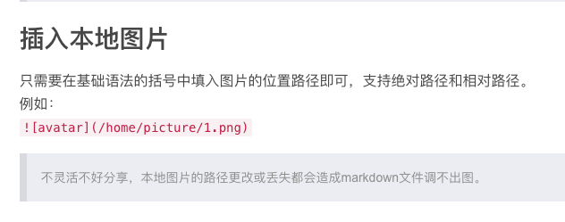

### 天池大数据竞赛——天池精准医疗大赛人工智能辅助糖尿病遗传风险预测赛后总结

## 天池大数据竞赛官方网址（[链接](https://tianchi.aliyun.com/competition/gameList.htm?spm=5176.100065.5610717.7.530d3eab58ZOrA)）

## 六、预测算法

### 1. LightGBM
#### &emsp;&emsp;LightGBM利用基于histogram的算法，通过将连续特征（属性）值分段为discrete bins来加快训练的速度并减少内存的使用。直方图算法的基本思想：先把连续的浮点特征值离散化成k个整数，同时构造一个宽度为k的直方图。遍历数据时，根据离散化后的值作为索引在直方图中累积统计量，当遍历一次数据后，直方图累积了需要的统计量，然后根据直方图的离散值，遍历寻找最优的分割点。基于histogram算法有很多优点，包括减少分割增益的计算量、通过直方图的相减来进行进一步的加速、减少内存的使用、减少并行学习的通信代价等。
#### &emsp;&emsp;Gradient Boosting Decision Tree（GBDT）是一种被广泛使用的算法，目前也有很多实现方法，比如说scikit-learn，LightGBM。其实关于梯度提升树不同的实现，本质就是所使用的损失函数和最小化损失函数的方法有所差异。而梯度提升算法的核心思想就是通过拟合负梯度值去学习决策树。
#### &emsp;&emsp;相关代码如下，仍需要根据实际应用做出相应的更改。


```python
# coding=utf-8
'''
Author: chenhao
date: Jan.25.2018
Description: Use the train_Drop_Delete_Log.csv and PolynomialFeature in XGB model
'''
import pandas as pd
import datetime
import numpy as np
from dateutil.parser import parse

modelfile = 'modelweight.model' #神经网络权重保存

data_path = 'data/'

train = pd.read_csv(data_path + 'train_Drop_Delete_Log_Poly_keras.csv', encoding='gb2312')
test = pd.read_csv(data_path + 'test_Drop_Delete_Log_Poly_keras.csv', encoding='gb2312')

# 对数据简单处理
train_y = train['BS']
train_x = train.drop(['BS'],axis=1)
test_x = test

test_preds = np.zeros((test_x.shape[0],1))

train_x = train_x.as_matrix()
train_y = train_y.as_matrix()
test_x = test_x.as_matrix()

# 3 建立一个简单BP神经网络模型
from keras.models import Sequential
from keras.layers.core import Dense, Activation
model = Sequential()  #层次模型
model.add(Dense(100,input_dim=801,init='uniform')) #输入层，Dense表示BP层
model.add(Activation('relu'))  #添加激活函数
model.add(Dense(1,input_dim=100))  #输出层
model.compile(loss='mean_squared_error', optimizer='adam') #编译模型
model.fit(train_x, train_y, nb_epoch = 1000, batch_size = 6) #训练模型1000次
model.save_weights(modelfile) #保存模型权重

#4 预测，并还原结果。
#x = ((data[feature] - data_mean[feature])/data_std[feature]).as_matrix()
#data[u'L1_pred'] = model.predict(x) * data_std['L1'] + data_mean['L1']


test_preds = model.predict(test_x)
print(test_preds)

submission = pd.DataFrame({'pred': test_preds.mean(axis=1)})
submission.to_csv(r'sub{}.csv'.format(datetime.datetime.now().strftime('%Y%m%d_%H%M%S')), header=None, index=False, float_format='%.3f')
```


### 2. XGBoost
#### &emsp;&emsp;eXtreme Gradient Boosting(XGBoost)是Gradient Boosting Machine的另外一种实现，其最大的特点在于，它能够自动利用CPU的多线程进行并行，同时在算法上加以改进，提高了精度。XGBoost的主要特点包括，基于树能够自动处理稀疏数据的提升学习算法，采用加权分位数法来搜索近似最优分裂点，并行和分布式计算，基于分块技术的大量数据高效快速处理。
#### &emsp;&emsp;XGBoost不同于传统的GBDT的方式，其只利用了一阶的导数信息并对损失函数做了二阶的泰勒展开，并在目标函数之外加入了正则项整体求最优解，用以权衡目标函数的下降和模型的复杂程度，避免过拟合。将目标函数做泰勒展开，并引入正则项。相关的理论介绍在CSDN中均可搜索到。编辑器输入公式太不方便了。。
#### &emsp;&emsp;相关代码如下，仍需要根据实际应用做出相应的更改。

### 3. Keras
#### &emsp;&emsp;Keras是基于Theano的一个深度学习框架，是一个高度模块化的神经网络库，支持GPU和CPU。Keras有多个独立的模块，且可以自由组合，其中包括neural layers, cost functions, optimizers, initialization schemes, activation functions, regularization. Keras的核心是一个模型，用来阻止各个网络层次结构。最简单的是Sequential模型，即序贯模型，是一个个网络层的线性叠加。对于更复杂的结构，应该使用keras提供的function API. function API允许构建任何的网络结构。
#### &emsp;&emsp;下面是Keras的一些模块的介绍：
#### &emsp;&emsp;Optimizers，Optimizers包含了一些优化的方法，比如最基本的随机梯度下降SGD,另外还有Adagrad、Adadelta、RMSprop、Adam，一些新的方法以后也会被不断添加进来。
#### &emsp;&emsp;Objectives，这是目标函数模块，keras提供了mean_squared_error，mean_absolute_error，squared_hinge，hinge，binary_crossentropy，categorical_crossentropy这几种目标函数。
#### &emsp;&emsp;Activations，这是激活函数模块，keras提供了linear、sigmoid、hard_sigmoid、tanh、softplus、relu、softplus，另外softmax也放在Activations模块里(我觉得放在layers模块里更合理些）。此外，像LeakyReLU和PReLU这种比较新的激活函数，keras在keras.layers.advanced_activations模块里提供。
#### &emsp;&emsp;Initializations，这是参数初始化模块，在添加layer的时候调用init进行初始化。keras提供了uniform、lecun_uniform、normal、orthogonal、zero、glorot_normal、he_normal这几种。
#### &emsp;&emsp;Layers，layers模块包含了core、convolutional、recurrent、advanced_activations、normalization、embeddings这几种layer。其中core里面包含了flatten(CNN的全连接层之前需要把二维特征图flatten成为一维的)、reshape（CNN输入时将一维的向量弄成二维的）、dense(就是隐藏层，dense是稠密的意思),还有其他的就不介绍了。convolutional层基本就是Theano的Convolution2D的封装。
#### &emsp;&emsp;Preprocessing，这是预处理模块，包括序列数据的处理，文本数据的处理，图像数据的处理。重点看一下图像数据的处理，keras提供了ImageDataGenerator函数,实现data augmentation，数据集扩增，对图像做一些弹性变换，比如水平翻转，垂直翻转，旋转等。
#### &emsp;&emsp;Models，这是最主要的模块，模型。上面定义了各种基本组件，model是将它们组合起来。
#### &emsp;&emsp;相关代码如下，仍需要根据实际应用做出相应的更改。

## 七、模型融合

#### &emsp;&emsp;原始训练数据集中，高血糖值的个体样本数量过少，导致构建出来的模型对于高血糖部分预测不准确，同时由下面的的评价标准可以得知，高血糖样本测试集的预测结果对于结果的评价具有重要意义。实现单模型融合的过程中，需要增大训练集中高血糖个体的权重，因此将测试集中已预测出的数据进行比较，对于较高的测试集样本认为是疑似高血糖测试集样本，并将其筛选出来用高血糖预测模型来预测该部分的数据并存储。这种数据提升的模型能够有效的提升高血糖部分样本预测的准确性。
#### &emsp;&emsp;数据融合与提升的模型结构示意图如图9所示，首先，从初始的训练集中提取高血糖值的个体样本，采用相应的算法搭建模型预测，获得对应的高血糖预测模型。从初始的测试集中用单模型进行预测，对于预测结果超过平均值一定阈值的样本个体作为疑似高血糖样本个体提取出来，用高血糖预测模型进行预测并保存，通过相应的融合方式完整整个数据集的融合。经试验与测试，这种方法能够有效地提升预测的结果，具体结果参见第八部分。



## 八、评价指标与结果

### 1. 评价指标
#### &emsp;&emsp;将测试集中预测得到的结果与个体实际检测到的血糖结果进行对比，以均方误差为评价指标，得出的结果越小越好，均方误差的计算公式如下：

<div align=center>


#### &emsp;&emsp;其中，m为总人数，y(i)为选手预测的第i个人的血糖值，y(i)为第i个人的实际血糖检测值。

### 2. 测试结果
#### &emsp;&emsp;本次选取7次试验的结果作为课题试验的结果，试验测试的结果如图10所示，分别用LightGBM、XGBoost、Keras作为三种单模型结构，同时添加模型融合提到的融合预测模型参与比对。图中X轴表示进行7次试验并且每次试验对每个模型进行调优与修改，Y轴表示评价指标下的结果。由图可知，大部分的情况下单模型预测的结果Keras优于LightGBM优于XGBoost，融合预测模型的预测效果比所有的单模型有显著的提升。

<div align=center>

